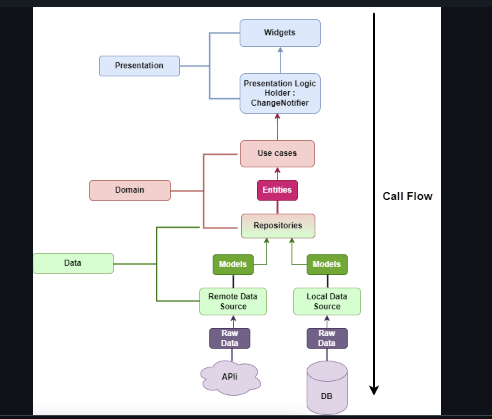
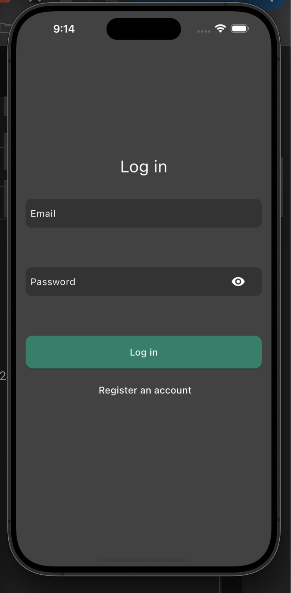
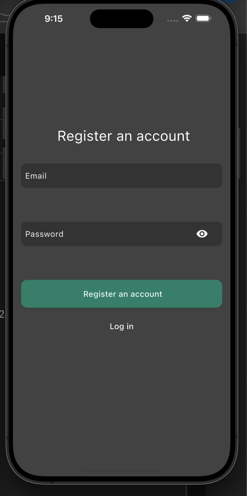
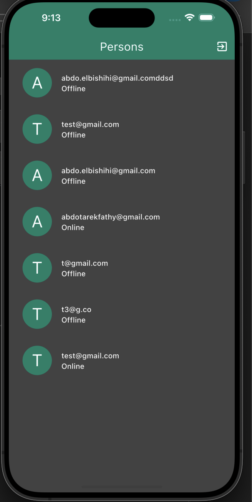
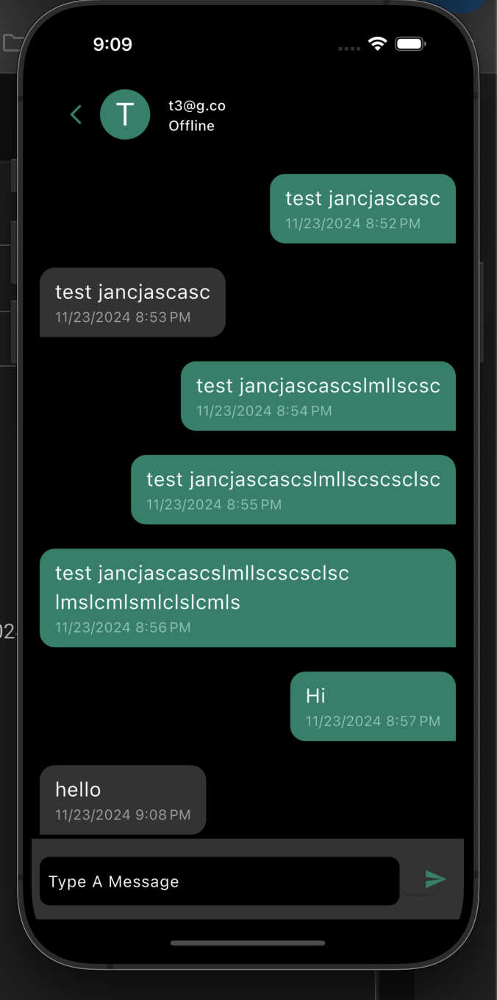
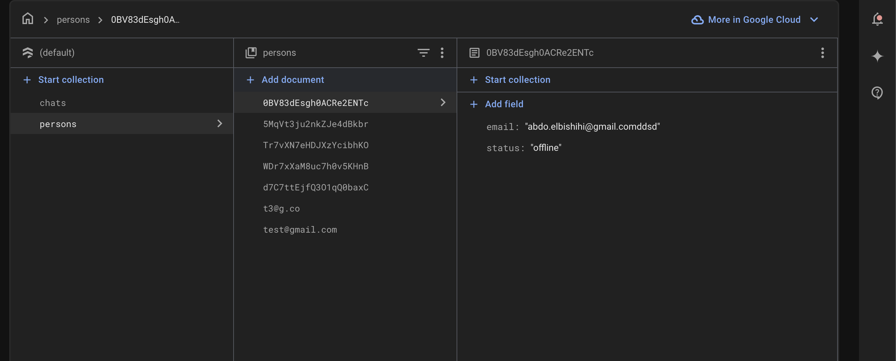
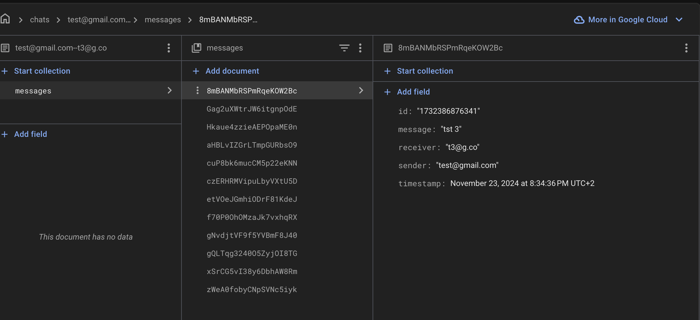

## Getting Started

1. if add new key to strings_ar.i18n file, you need to add it to strings.i18n file too, otherwise it will not be translated.
2. run command to generate translations files:
dart run slang
 
Change app package name

flutter pub run change_app_package_name:main com.package.name

Change app icon

flutter pub run flutter_launcher_icons:main

4. I follow clean arch

in Core you can find data & domain as they are shared in app with local & remote datasources & repository & repositoryImp

on features folder you can find usecases which are the business logic
& presentation layer  

1. Login page:

2. Signup page:

3. Persons page:

4. Chat page:

Firebase database structure: 
persons:
/persons/id

chats:
/chats/chatId/messages/messageId

